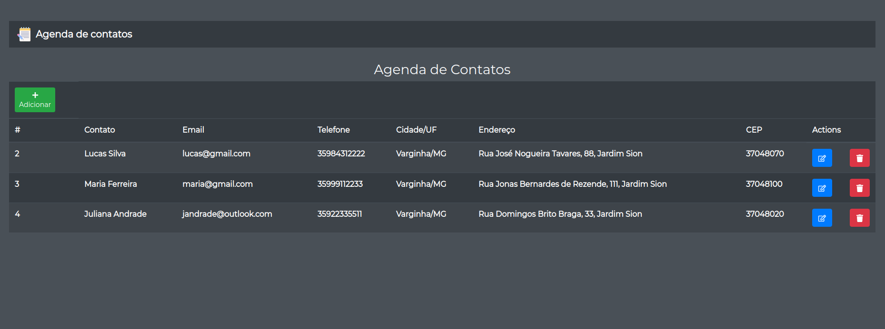

<h1 align="center">
    
</h1>

<p align="center">
 
  


  <a href="https://github.com/tgmarinho/nlw1/commits/master">
    
  </a>


   <a href="https://github.com/tgmarinho/nlw1/stargazers">
    
  </a>
   <a href="https://github.com/tgmarinho/nlw1/stargazers">
    
  </a>
</p>
<p align="center">

  


  

</p>


## Sobre o projeto

ContactBook - é uma agenda de contatos que pode salvar número, email, etc.
Com uso de autocomplete de endereço ao digitar um CEP com a chamada da api do
[Via Cep][viacep].

Os usuários encontrarão as seguintes funcionalidades:
- Cadastrar novo contado
- Editar contato existente
- Excluir contato existente
- Visualizar contatos

Os usuários terão acesso ao aplicativo web, onde poderão:
- Realizar operações de criar e editar um contato
- Visualizar os contatos
- Excluir contatos

Projeto desenvolvido para aplicar estudos do [ReactJS][reactjs] e [SpringBoot][spring]

## Layout

<p align="center" style="display: flex; align-items: flex-start; justify-content: center;">


  
</p>

## Tecnologias

As seguintes ferramentas foram usadas na construção do projeto:

#### **Website**

- [React][reactjs]
- [React Icons][react-icons]
- [Axios][axios]
- [Bootstrap][bootstrap]

#### **Server**

  - [SpringBoot][spring]
  - [Postgres][postgres]

## Como executar o projeto

Este projeto está dividido em 2 partes:
1. FrontEnd
2. Backend

### Pré-requisitos

Antes de começar, você vai precisar ter instalado em sua máquina as seguintes ferramentas:
[Git](https://git-scm.com), [Node.js][nodejs], [Java JDK 11][java-11], [Maven][maven] e [PostgresSQL][postgres].
Além disto é bom ter um editor para trabalhar com o código como [VSCode][vscode] ou [SpringTools][springtools]

### Banco de dados

O banco de dados utilizado é o PostgresSQL
Antes de iniciar a aplicação crie o banco de dados: `CREATE DATABASE contact_book`

### Rodando o Backend (Servidor)
Verifique no arquivo **application.properties** se o nome de usuário e senha
de seu banco de dados é o default (username: postgres e password: postgres). Caso não seja, troque de acordo com suas credenciais.

```bash
# Clone este repositório
$ git clone https://github.com/rafaelabc/contact-book

# Acesse a pasta do projeto no terminal/cmd
$ cd contact-book

# Acesse a pasta do backend do projeto no terminal/cmd
$ cd backend

# Inicie a aplicação
$ mvn spring-boot:run

# A aplicação será aberta na porta:8080
```

### Rodando a aplicação web (Front End)

```bash
# Clone este repositório
$ git clone https://github.com/rafaelabc/contact-book

# Acesse a pasta do projeto no terminal/cmd
$ cd contact-book

# Acesse a pasta do frontend do projeto no terminal/cmd
$ cd frontend

# Instale as dependências
$ yarn install

# Inicie a aplicação
$ yarn start

# A aplicação será aberta na porta:3000 - acesse http://localhost:3000
```

## Licença

Este projeto esta sobe a licença MIT.

Feito por Rafaela Custódio - [Entre em contato!](https://www.linkedin.com/in/rafaela-custodio/)

[axios]: https://github.com/axios/axios
[bootstrap]: https://getbootstrap.com/
[react-icons]: https://react-icons.github.io/react-icons/
[spring]: https://spring.io/projects/spring-boot
[viacep]: [https://viacep.com.br]
[reactjs]: https://reactjs.org
[yarn]: https://yarnpkg.com/
[vscode]: https://code.visualstudio.com/
[vceditconfig]: https://marketplace.visualstudio.com/items?itemName=EditorConfig.EditorConfig
[license]: https://opensource.org/licenses/MIT
[prettier]: https://marketplace.visualstudio.com/items?itemName=esbenp.prettier-vscode
[postgres]: https://www.postgresql.org/
[maven]: https://maven.apache.org/download.cgi
[java-11]: https://openjdk.java.net/projects/jdk/11/
[nodejs]: https://nodejs.org/en/
[springtools]: https://spring.io/tools
